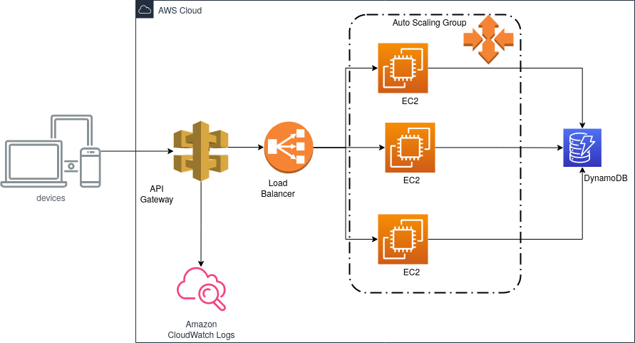
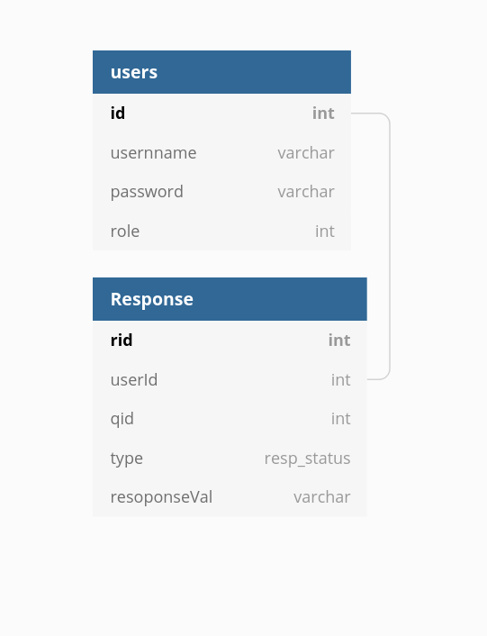

# SimpleUserOnboarding


## Endpoint 
```
        path : /login
        body : {username:string,password:string}
        Return : JWT_TOKEN:Success | error:Failure
```
<br>


```

        path : /addAnswer 
        header : {Authorization:JWT_TOKEN}
        body : {answer:[{qid:string,type:string,response:string}]}
        Returns : 200:Success | Failure
```


<br>

```

        path : /CalcScore 
        header : {Authorization:JWT_TOKEN}
        Returns : 200:Success,Score:Number | Failure
```


<br>

```

        path : /getAllAnswers 
        header : {Authorization:JWT_TOKEN}
        body : {}
        Returns : 200:Success , answers:[{qid:string,type:string,response:string},...] | Failure
```


<br>


```
        path: /isOnboarded
        header : {Authorization:JWT_TOKEN}
        Returns : 200:Success , {true|false}  || failure (Internal Server Error)
```


<br>
<br>

## Arch For Cloud



## ER Diagram




